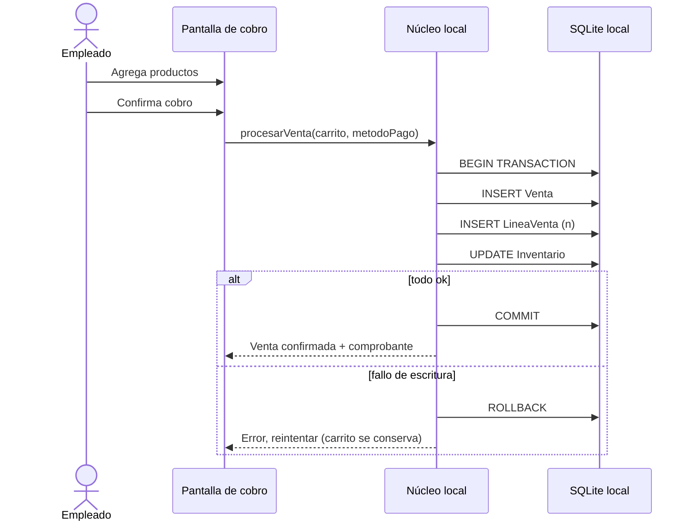
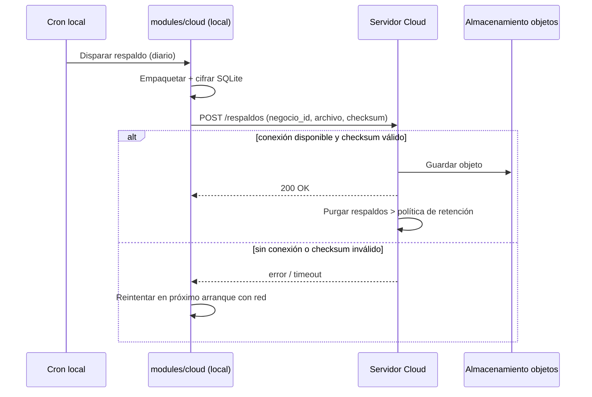
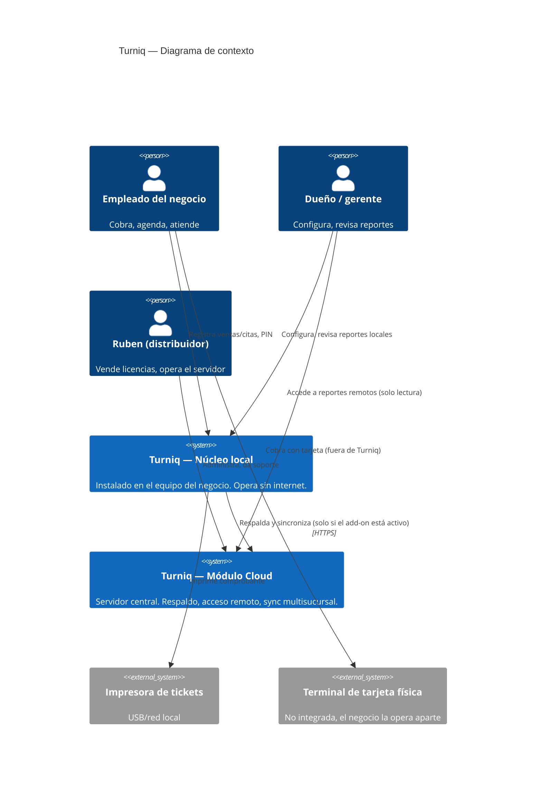
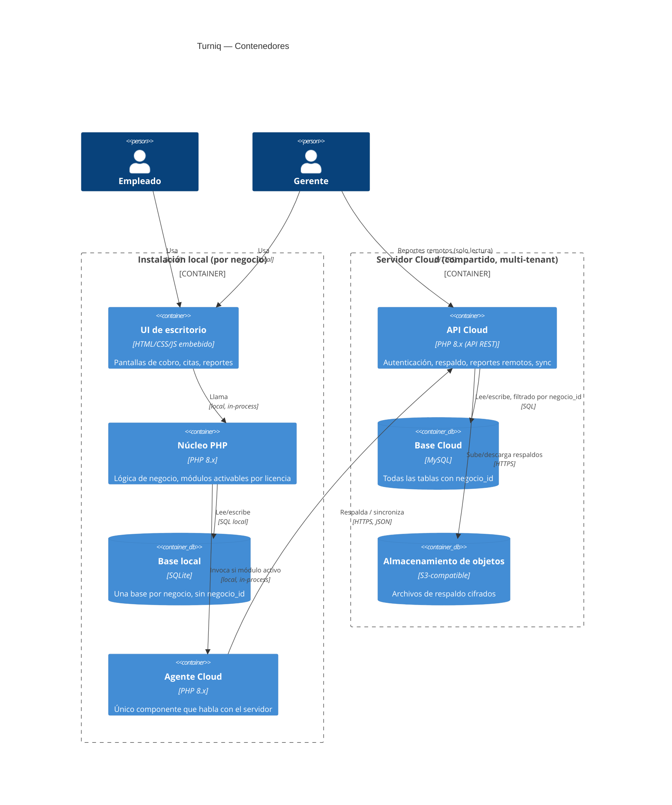
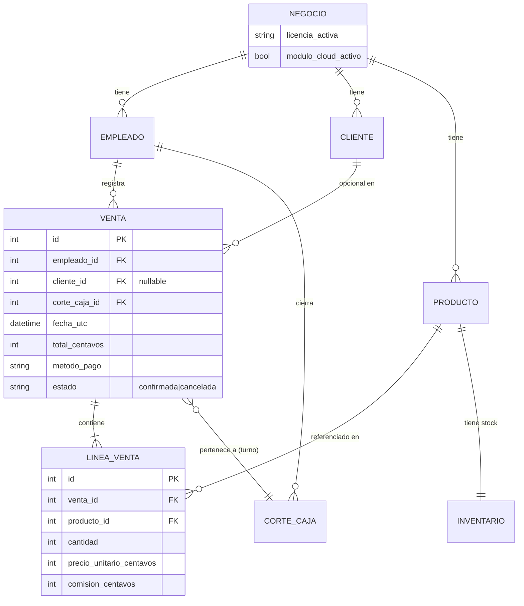
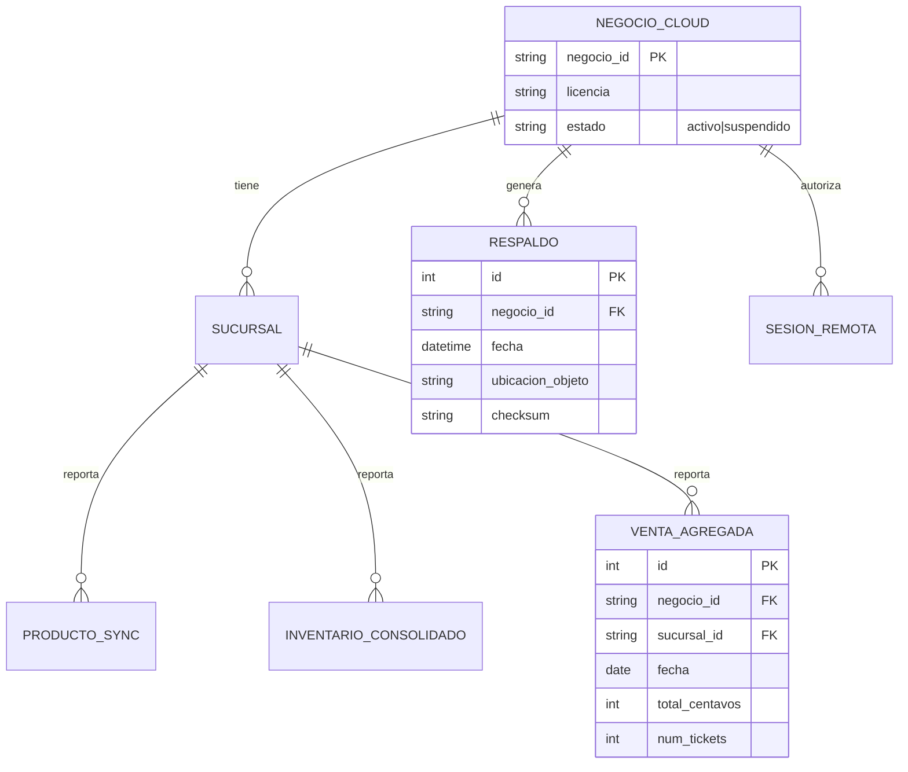

# Arquitectura — Turniq

| | |
|---|---|
| **Versión** | 1.0 |
| **Fecha** | 2026-07-25 |
| **Autor** | Ruben Fuentes (con Claude como copiloto de arquitectura) |
| **Estado** | Borrador — pendiente de validar ADR-003 y ADR-005 con el primer cliente real |

---

## 1. Resumen ejecutivo

- **Qué se construye:** un sistema de gestión de negocio (ventas, citas, inventario, caja) que se instala en el equipo del negocio y opera sin depender de internet, con un módulo de nube opcional y de pago mensual para respaldo, acceso remoto y sincronización entre sucursales.
- **Cómo, en una línea:** PHP 8 monolito modular sobre SQLite local para el núcleo; PHP 8 + MySQL en un VPS único, multi-tenant por `negocio_id`, para el módulo nube.
- **Costo mensual estimado de infraestructura:** $0 al arranque (el núcleo no requiere servidor); $250–450 MXN/mes cuando el módulo nube entra en operación con los primeros clientes; ~$900–1,400 MXN/mes en el escenario de 40 negocios con nube activa en un solo VPS. *(Estimación 2026-07-25, fuente: precios públicos de Hostinger/DigitalOcean/Vultr para VPS de 2-4GB, ver Anexo B.)*
- **Tiempo estimado a primera versión en producción:** 8-10 semanas de núcleo local vendible (Fase 1-2 del roadmap ya documentado), con un equipo de 1 persona a 10-20h/semana. El módulo nube no arranca hasta tener clientes reales pagando el núcleo — ver Plan de entrega.
- **Los tres riesgos principales:**
  1. Construir el módulo nube antes de validar demanda del núcleo local (orden equivocado quema las únicas horas disponibles).
  2. Aislamiento de `negocio_id` mal implementado en el módulo nube — es el único punto donde un error expone datos de un negocio a otro.
  3. Un solo desarrollador sin respaldo operativo: si Ruben no puede operar una semana, no hay nadie que atienda un incidente de nube.

---

## 2. Contexto y alcance

**Problema que resuelve.** Negocios pequeños en México (barberías, bares, talleres, spas, consultorios) operan con libretas o Excel. El software existente es genérico y caro por suscripción, o no se adapta a su giro. Turniq da un núcleo local de pago único, con nube opcional solo donde aporta valor real (respaldo, multisucursal).

**Actores.**
- **Dueño/gerente** — configura el negocio, ve reportes, decide si activa el módulo nube.
- **Empleado (cajero, staff)** — opera el día a día: ventas, citas, cobros, cortes de caja. Entra con PIN, no con usuario/contraseña completo.
- **Ruben (distribuidor/soporte)** — vende licencias, da soporte por WhatsApp, opera el servidor del módulo nube.
- **Servidor Cloud** — actor técnico: recibe respaldos, sirve reportes remotos, sincroniza entre sucursales.

**Dentro de alcance (v0.1 → v1.0 de este documento).**
- Núcleo local: ventas/citas, clientes, staff con PIN, pagos, inventario, cortes de caja, reportes, alertas.
- Sistema de licencias local (Starter, Pro, Custom).
- Módulo Cloud: respaldo automático, acceso remoto de solo lectura, sincronización multisucursal (licencia Multi).

**Fuera de alcance (explícitamente, para esta versión).**
- Escritura remota (registrar una venta desde fuera del negocio).
- Facturación electrónica / CFDI.
- App móvil nativa.
- Pagos con tarjeta integrados (se asume que el negocio usa su terminal física actual; Turniq solo registra el método de pago, no procesa el cobro).
- Multi-idioma — el sistema es español México únicamente.

**Supuestos.**
- El negocio típico tiene entre 1 y 5 empleados y una sola sucursal al inicio. *Si resulta falso (clientes con 10+ empleados desde el día uno) → el modelo de PIN por empleado y el dashboard de reportes necesitan revisión de UX antes de venderlo a ese segmento.*
- El equipo del negocio tiene Windows en la mayoría de los casos. *Si hay demanda real de macOS/Linux → afecta la elección de empaquetado del instalador (ver ADR-006), hoy no evaluada.*
- Ruben es el único desarrollador durante Fase 1-3 del roadmap. *Si se suma alguien más → revisar convenciones de rama y CI antes de que el segundo desarrollador toque el repo.*
- El volumen objetivo de negocios con nube activa no pasa de ~150 en los primeros 2 años. *Si se dispara antes → el VPS único (ADR-004) se queda corto, hay que revisar particionamiento.*

**Restricciones.**
- Presupuesto de infraestructura: prácticamente $0 hasta tener clientes pagando; no se justifica gasto de servidor antes de la Fase 3 del roadmap.
- Sin fecha límite dura impuesta por un tercero, pero sí una meta de negocio: primeros clientes fundador facturando en las próximas 8-10 semanas según el roadmap de marketing ya en marcha.
- Cumplimiento: LFPDPPP aplica (datos de clientes de los negocios). No se procesan datos de salud ni de tarjetas directamente.

---

## 3. Flujos del sistema

### 3.1 Venta y cobro (núcleo local)

**Disparador:** un empleado inicia una venta desde la pantalla de cobro.
**Precondiciones:** empleado autenticado con PIN; turno de caja abierto.
**Pasos:**
1. Empleado agrega productos/servicios al carrito.
2. Sistema calcula total y comisión del empleado según reglas configuradas.
3. Empleado selecciona método de pago (efectivo, tarjeta externa, transferencia) y confirma.
4. Sistema registra `Venta` y sus `Línea de venta`, descuenta `Inventario` si aplica, y actualiza el acumulado del turno.
5. Sistema imprime o muestra el comprobante.

**Qué puede fallar y qué hace el sistema:**
- Se corta la energía/el equipo se apaga a mitad del cobro → la venta no debe quedar en un estado ambiguo. La escritura de `Venta` + `Línea de venta` + descuento de inventario debe ser una sola transacción local (SQLite `BEGIN`/`COMMIT`); si no completa, no existe la venta y el carrito se recupera desde un borrador local no confirmado.
- Inventario insuficiente al momento de confirmar → el sistema advierte pero permite continuar (negocio real vende aunque el conteo esté desfasado); la alerta de inventario negativo queda visible en el dashboard, no bloquea la venta.

**Postcondiciones:** venta registrada, inventario actualizado, comprobante disponible, comisión calculada y visible en el corte de caja.



### 3.2 Corte de caja (núcleo local)

**Disparador:** empleado o gerente cierra el turno.
**Precondiciones:** turno abierto con al menos una apertura registrada.
**Pasos:**
1. Sistema suma todas las ventas del turno por método de pago.
2. Empleado cuenta el efectivo físico y lo captura.
3. Sistema calcula diferencia (esperado vs. contado).
4. Se registra el `Corte de caja` con ambos montos y la diferencia.
5. El turno queda cerrado; no se pueden registrar más ventas contra él.

**Qué puede fallar:** el empleado cierra sesión antes de capturar el conteo físico → el turno queda "abierto sin cerrar" visualmente en el dashboard como alerta pendiente para el gerente, no se pierde el corte, se reanuda donde quedó.

### 3.3 Activación del módulo Cloud (frontera local ↔ nube)

**Disparador:** el negocio contrata el add-on Nube.
**Precondiciones:** licencia local activa (Starter o Pro).
**Pasos:**
1. Ruben genera un `negocio_id` en el servidor Cloud y una clave de vinculación.
2. El cliente ingresa esa clave en su instalación local (`modules/cloud`).
3. La instalación local queda asociada a ese `negocio_id` y empieza a respaldar en el siguiente ciclo programado.

**Qué puede fallar:**
- Sin internet en el momento de vincular → el sistema guarda la clave localmente y reintenta la vinculación en segundo plano cuando detecte conexión; el núcleo sigue operando sin bloqueo.
- El servidor Cloud no responde → igual: reintento con backoff, nunca bloquea venta ni cobro.

**Postcondiciones:** instalación vinculada; primer respaldo programado.

### 3.4 Respaldo automático (dentro de Cloud)

**Disparador:** cron local, intervalo configurado (diario por defecto).
**Precondiciones:** módulo Cloud vinculado y con internet disponible en el momento de ejecutar.
**Pasos:**
1. El módulo local empaqueta y cifra la base de datos SQLite.
2. Sube el archivo al servidor Cloud vía HTTPS, con `negocio_id` en la petición autenticada.
3. Servidor guarda el archivo en almacenamiento de objetos, asociado a ese `negocio_id`, y confirma.
4. Se purgan respaldos más antiguos que la política de retención (ver Modelo de datos).

**Qué puede fallar:**
- Sin internet en el horario programado → se reintenta en el siguiente arranque de la app con conexión detectada; si pasan más de 3 días sin respaldo exitoso, el dashboard local muestra una alerta visible al dueño.
- Sube corrupto/incompleto → el servidor valida checksum antes de confirmar; si falla, no reemplaza el último respaldo bueno.

**Postcondiciones:** respaldo disponible para restauración; el negocio nunca se entera de este flujo salvo que falle repetidamente.



### 3.5 Sincronización multisucursal (licencia Multi)

**Disparador:** intervalo de sincronización (más frecuente que el respaldo completo, p. ej. cada 15 min con conexión disponible).
**Precondiciones:** dos o más instalaciones con el mismo `negocio_id` y módulo Cloud activo.
**Pasos:**
1. Cada sucursal envía cambios de catálogo, inventario e importe agregado de ventas del día.
2. Servidor consolida por `negocio_id` y expone el dashboard multisucursal.
3. Cambios de catálogo se propagan de vuelta a las demás sucursales en el siguiente ciclo.

**Qué puede fallar:** dos sucursales editan el mismo producto casi simultáneamente → **gana el cambio con timestamp más reciente** (last-write-wins); se registra en un log de conflictos visible al gerente, no se descarta silenciosamente. *(Señal de revisión: si los conflictos superan 1% de las ediciones de catálogo, cambiar a resolución manual o edición exclusiva por sucursal designada.)*

### Máquinas de estado

**Turno de caja:** `cerrado → abierto → (ventas) → en_cierre → cerrado`. No se puede reabrir un turno cerrado; una corrección se registra como movimiento nuevo con referencia al turno original.

**Venta:** `borrador (carrito) → confirmada → (opcional) cancelada`. Una venta confirmada nunca se edita; una cancelación crea un registro de reversa, nunca borra la fila original (ver Modelo de datos, borrado lógico).

**Licencia:** `emitida → activada → (vigente) → suspendida (impago de nube, si aplica) → reactivada | revocada`. La suspensión solo afecta al módulo Cloud — el núcleo local con licencia perpetua sigue funcionando siempre, incluso con la nube suspendida.

---

## 4. Vista de arquitectura

### C4 — Contexto



### C4 — Contenedores



### Componentes y responsabilidades

| Componente | Responsabilidad | Tecnología | Se comunica con |
|---|---|---|---|
| UI de escritorio | Renderiza pantallas, captura interacción | HTML/CSS/JS embebido en la app local | Núcleo PHP (local) |
| Núcleo PHP (`core/`) | Autenticación por PIN, carga de módulos según licencia, orquestación de flujos | PHP 8.x | SQLite, Agente Cloud |
| Módulos de negocio (`modules/appointments`, `clients`, `staff`, `payments`, `reports`, `cashregister`, `alerts`) | Lógica específica de cada dominio | PHP 8.x | SQLite vía núcleo |
| Base local | Persistencia por negocio | SQLite | Núcleo PHP |
| Agente Cloud (`modules/cloud`) | Empaqueta respaldos, gestiona vinculación, envía/recibe con el servidor | PHP 8.x | API Cloud vía HTTPS |
| API Cloud | Autenticación de negocios, recepción de respaldos, reportes remotos, consolidación multisucursal | PHP 8.x (framework por definir, ver ADR-002) | MySQL, almacenamiento de objetos |
| Base Cloud | Persistencia multi-tenant | MySQL | API Cloud |
| Almacenamiento de objetos | Archivos de respaldo cifrados | S3-compatible (Backblaze B2 o similar) | API Cloud |

**Fronteras y dependencias.**
- El núcleo local **nunca** importa ni depende de código del Agente Cloud para sus flujos de venta/cita/caja — la dependencia es unidireccional: el core puede invocar al agente, el agente nunca modifica datos del core directamente (solo lee para empaquetar).
- Ningún módulo de negocio (`appointments`, `payments`, etc.) puede llamar directamente al Agente Cloud — solo el núcleo orquesta esa llamada, para poder desactivarla por completo si el negocio no tiene el add-on.
- La API Cloud nunca escribe en la base local de ningún negocio — la relación de escritura remota está explícitamente fuera de alcance (ver sección 2).

---

## 5. Decisiones de arquitectura (ADRs)

### ADR-001 — Monolito modular, no microservicios

**Estado:** aceptado
**Fecha:** 2026-07-25

**Contexto:** un solo desarrollador, equipo de una persona, dos "sistemas" reales (núcleo local, módulo cloud) que además tienen ciclos de vida y ubicación de ejecución distintos.

**Decisión:** cada uno de los dos sistemas (núcleo local, servidor Cloud) es un monolito modular independiente, con módulos de negocio como carpetas con fronteras claras dentro de cada uno — no microservicios dentro de ninguno de los dos.

**Alternativas consideradas**

| Opción | A favor | En contra | Por qué no |
|---|---|---|---|
| Microservicios (uno por módulo de negocio) | Escalado independiente en teoría | Consistencia distribuida, 3-5× costo operativo, un solo dev no puede operar eso | Sobra por completo para el tamaño de equipo y de carga |
| Un solo monolito que incluya la lógica de nube dentro del núcleo local | Un solo código base | Rompe la promesa de "funciona sin internet" — el núcleo quedaría acoplado a dependencias de red aunque no se usen | La separación local/nube no es organizativa, es de producto |

**Consecuencias:** fácil de operar y depurar con un solo desarrollador; el costo es disciplina de fronteras entre módulos (sin ella, se vuelve una bola de lodo con el tiempo). Revertir esta decisión (ir a microservicios) costaría meses y no tiene sentido antes de tener equipo.

**Señales de revisión:** si algún día hay más de 3-4 desarrolladores trabajando en paralelo y se bloquean constantemente entre módulos.

---

### ADR-002 — PHP 8.x para ambos sistemas, sin framework pesado en el núcleo local

**Estado:** aceptado
**Fecha:** 2026-07-25

**Contexto:** el equipo (Ruben) es productivo en PHP hoy (CitaFlow, sistema de bar ya construidos así). El README del repo ya declara PHP 8.x. Cambiar de stack no tiene justificación de negocio.

**Decisión:** núcleo local en PHP 8.x plano o con un micro-framework ligero (a evaluar: Slim o sin framework, dado que es una app de escritorio empaquetada, no un servidor web tradicional). API Cloud en PHP 8.x con un framework más completo (Laravel o Slim + componentes) porque ahí sí hay superficie real de API pública, autenticación y ORM que vale la pena no reinventar.

**Alternativas consideradas**

| Opción | A favor | En contra | Por qué no |
|---|---|---|---|
| Node/TypeScript | Tipado, ecosistema grande | Ruben no es productivo hoy en ese stack; reescribir el núcleo ya construido no aporta valor | Costo de cambio sin beneficio claro |
| Python/FastAPI para el Cloud | Rápido de escribir, tipado con Pydantic | Dos lenguajes en el proyecto (PHP local + Python nube) duplica la carga cognitiva de un solo dev | Prioriza consistencia sobre "mejor herramienta en abstracto" |

**Consecuencias:** un solo lenguaje en todo el proyecto — más fácil para un solo desarrollador. El costo es que PHP tiene reputación injusta en contratación futura si algún día se suma alguien más; mitigable con buenas convenciones desde ahora.

**Señales de revisión:** si se contrata a alguien que solo domina otro stack y el costo de productividad de forzar PHP supera el de mantener dos lenguajes.

---

### ADR-003 — SQLite para el núcleo local, MySQL para el módulo Cloud

**Estado:** aceptado — **pendiente de validar con el primer cliente real que use inventario de alto volumen**
**Fecha:** 2026-07-25

**Contexto:** el núcleo es de un solo escritor (un negocio, una instalación) y debe operar sin servidor de base de datos que instalar. El módulo Cloud es multiusuario (múltiples negocios) y necesita concurrencia de escritura real.

**Decisión:** SQLite como base local por defecto (el README ya lo declara); MySQL en el servidor Cloud, con `negocio_id` en cada tabla.

**Alternativas consideradas**

| Opción | A favor | En contra | Por qué no |
|---|---|---|---|
| MySQL también local | Un solo motor en todo el proyecto | Requiere instalar y operar un servidor MySQL en el equipo del cliente — rompe la promesa de instalación simple sin dependencias | Contradice el valor central de "se instala y ya" |
| PostgreSQL en el Cloud en vez de MySQL | Más rico en tipos, JSONB, mejor bajo carga compleja | El equipo ya opera MySQL en otros proyectos (CitaFlow); no hay razón de dominio que justifique el cambio de motor | Preferencia de "lo que ya conoces" gana cuando no hay una necesidad técnica concreta que lo desempate |

**Consecuencias:** cero fricción de instalación para el cliente; el costo es que SQLite tiene concurrencia de escritura limitada — **si algún día un solo negocio necesita múltiples cajas escribiendo simultáneamente en la misma base sin coordinación, esto se queda corto.**

**Señales de revisión:** un cliente con 3+ puntos de cobro simultáneos en la misma sucursal escribiendo a la misma base. Si aparece, evaluar MySQL local opcional (el README ya lo deja como alternativa) antes de prometerlo a ese cliente.

---

### ADR-004 — Un solo VPS para el módulo Cloud, sin Kubernetes ni serverless

**Estado:** aceptado
**Fecha:** 2026-07-25

**Contexto:** carga esperada del módulo Cloud es baja (subir archivos de respaldo, servir reportes de solo lectura) hasta los ~150 negocios en 2 años. Un solo operador, sin presupuesto.

**Decisión:** VPS único (2-4GB RAM) con Docker Compose corriendo la API Cloud, MySQL y un proxy reverso (Nginx/Caddy) con TLS automático.

**Alternativas consideradas**

| Opción | A favor | En contra | Por qué no |
|---|---|---|---|
| PaaS (Railway, Render) | Despliegue en minutos, cero Linux que operar | Se encarece más rápido que un VPS a este volumen; el módulo Cloud es liviano, no justifica el premium | El ahorro de tiempo no compensa el costo a este volumen |
| Kubernetes gestionado | Escala "real" | Un operador no puede sostenerlo; sobreingeniería total para la carga descrita | Ni siquiera cerca de justificarse |

**Consecuencias:** Ruben es el equipo de operaciones — responsable de parches, respaldos del propio servidor y monitoreo. El costo de revertir (mover a PaaS después) es bajo: es una app en contenedores, portable.

**Señales de revisión:** más de ~150 negocios con nube activa, o el VPS mostrando saturación de CPU/IO sostenida en el panel de monitoreo.

---

### ADR-005 — Aislamiento multi-tenant: esquema compartido con `negocio_id`, no base por cliente

**Estado:** aceptado
**Fecha:** 2026-07-25

**Contexto:** el módulo Cloud atenderá decenas a cientos de negocios desde un solo servidor. Hay que decidir cómo se aíslan sus datos.

**Decisión:** esquema compartido en MySQL, con `negocio_id` obligatorio en cada tabla del módulo Cloud, filtrado a través de una capa de acceso a datos centralizada que lo inyecta automáticamente — nunca a mano en cada endpoint.

**Alternativas consideradas**

| Opción | A favor | En contra | Por qué no |
|---|---|---|---|
| Base de datos por cliente | Aislamiento total, cero riesgo de fuga entre tenants por bug de query | 150 bases de datos = 150 migraciones cada vez, pesadilla operativa para un solo dev | El costo operativo supera por mucho el riesgo que mitiga a este volumen |
| Esquema por cliente (mismo motor, distinto schema) | Aislamiento razonable, migraciones algo más manejables | Sigue siendo N migraciones por cambio; MySQL maneja esto peor que Postgres | No resuelve el problema operativo, solo lo reduce parcialmente |

**Consecuencias:** una sola base que migrar, operar y respaldar. El costo es que el aislamiento depende 100% de disciplina de código — un query sin el filtro de `negocio_id` es una fuga de datos entre negocios. Se mitiga con la capa de acceso centralizada (no opcional) y pruebas automatizadas específicas para IDOR (ver Requisitos no funcionales, Seguridad).

**Señales de revisión:** un cliente empresarial que exige contractualmente aislamiento físico de base de datos (poco probable en el segmento PyME que Turniq ataca, pero posible en licencia Custom).

---

### ADR-006 — Empaquetado del núcleo local: por definir, con placeholder documentado

**Estado:** propuesto — no bloquea Fase 1-2 del roadmap
**Fecha:** 2026-07-25

**Contexto:** el README ya marca "empaquetado por definir (v0.2)". Hay que elegir cómo se distribuye el núcleo al equipo del cliente sin exigirle instalar PHP manualmente.

**Decisión (propuesta, no cerrada):** evaluar un empaquetado tipo Electron (embebe PHP + un runtime local, ej. vía servidor PHP embebido + WebView) o un instalador que incluya PHP portable para Windows. Se decide con evidencia real cuando se llegue a la Fase 2 del roadmap, no antes.

**Alternativas consideradas (preliminar, se revisará antes de decidir en firme)**

| Opción | A favor | En contra | Por qué no (aún no descartada) |
|---|---|---|---|
| Electron + servidor PHP embebido | UI familiar, empaquetado maduro | Peso del instalador, curva de empaquetar PHP dentro | Pendiente de prototipo |
| Instalador nativo Windows con PHP portable | Más ligero | Menos ergonomía de desarrollo de UI | Pendiente de prototipo |

**Consecuencias:** este ADR queda deliberadamente abierto — cerrarlo antes de tener el núcleo funcional sería decidir a ciegas.

**Señales de revisión:** este ADR se cierra al llegar a la Fase 2 del roadmap (empaquetado real), no antes.

---

## 6. Modelo de datos

*(Resumen de alto nivel. El detalle campo por campo ya vive en `docs/modelo-datos.md` del repo — aquí se agregan las cardinalidades, invariantes y estrategia de migración que faltaban.)*

### Diagrama entidad-relación — Núcleo local



### Diagrama entidad-relación — Módulo Cloud



**Invariantes de negocio clave:**
- `LINEA_VENTA.precio_unitario_centavos` nunca es negativo; una devolución se modela como una `VENTA` nueva con signo invertido, nunca editando la original.
- Toda tabla del módulo Cloud lleva `negocio_id` NOT NULL — sin excepción, ni siquiera en tablas de configuración global.
- El dinero se almacena siempre en **centavos, enteros** — nunca `float`/`double` (ADR implícito, pero no negociable: evita errores de redondeo acumulados en reportes).
- Fechas en **UTC** en almacenamiento; se presentan en hora de México (`America/Mexico_City`) en la UI.

**Decisiones de datos.**
- **Borrado lógico** en `VENTA`, `CLIENTE`, `PRODUCTO` (columna `activo`/`estado`) — nunca borrado físico de una venta confirmada, por trazabilidad fiscal y de auditoría. Borrado físico permitido solo en `LINEA_VENTA` de un carrito en estado `borrador` nunca confirmado.
- **Auditoría mínima**: cada cambio de PIN, cada anulación de venta y cada corte de caja quedan con `empleado_id` y timestamp — no se necesita un log genérico de auditoría para v0.1, pero estas tres operaciones sí lo requieren desde el día uno.

**Estrategia de migración.**
- Núcleo local: migraciones versionadas con un runner simple propio (numeradas `0001_...sql`, `0002_...sql`), aplicadas al arrancar la app si detecta versión desactualizada. Deben ser siempre hacia adelante — no hay rollback automático en el equipo del cliente; un error de migración se corrige con una migración nueva, no revirtiendo.
- Módulo Cloud: herramienta de migraciones del framework elegido en ADR-002 (si es Laravel, sus migraciones nativas), probadas contra una copia de la base antes de aplicar en producción.

**Volumen y crecimiento.**
- Núcleo local por negocio: unas 10-50 ventas/día → ~15,000-18,000 filas de `VENTA` al año por negocio. Trivial para SQLite.
- Módulo Cloud a 2 años (150 negocios, ~40% con nube activa = 60 negocios): `RESPALDO` crece ~60 × 365 = ~22,000 filas/año (metadatos, el archivo real vive en almacenamiento de objetos). `VENTA_AGREGADA` (solo agregados diarios) es igual de liviana. Nada de esto exige archivado antes del año 3.

---

## 7. Contratos e integraciones

**API pública (módulo Cloud).** REST sobre HTTPS, versionada en la ruta (`/v1/...`), autenticación por token de negocio (emitido en la activación, ADR de auth pendiente de detallar cuando se implemente la Fase 3 del roadmap — placeholder: token opaco de larga duración + posibilidad de rotarlo, no OAuth completo, es una integración instalación↔servidor, no un login de usuario final).

**Formato de error estándar:**
```json
{ "error": { "code": "NEGOCIO_NO_ENCONTRADO", "message": "El negocio_id no existe o el token no es válido", "request_id": "..." } }
```

**Endpoints principales (módulo Cloud, v1 mínimo viable para Fase 3 del roadmap):**

| Método | Ruta | Propósito | Autorización |
|---|---|---|---|
| POST | `/v1/respaldos` | Subir un respaldo cifrado | Token de negocio |
| GET | `/v1/respaldos/ultimo` | Obtener metadatos del último respaldo válido | Token de negocio |
| GET | `/v1/reportes/dashboard` | Reportes de solo lectura para acceso remoto | Token de negocio + sesión de acceso remoto |
| POST | `/v1/sync/catalogo` | Enviar cambios de catálogo (solo licencia Multi) | Token de negocio + sucursal |
| GET | `/v1/sync/catalogo` | Obtener catálogo consolidado (solo licencia Multi) | Token de negocio + sucursal |

**Idempotencia:** `POST /v1/respaldos` debe aceptar un `checksum` como clave de deduplicación — si el mismo archivo se sube dos veces (reintento tras timeout sin confirmación), el servidor detecta el duplicado y responde 200 sin duplicar almacenamiento.

**Eventos internos:** no hay bus de eventos en v1 — el volumen no lo justifica (ver ADR-001, principio de "la solución más aburrida"). Si en el futuro se necesita reaccionar a sincronizaciones en tiempo real entre sucursales, se evalúa entonces.

**Terceros.**

| Servicio | Para qué | Modo de falla | Plan B | Costo |
|---|---|---|---|---|
| Almacenamiento de objetos (Backblaze B2 o similar) | Guardar archivos de respaldo cifrados | Timeout / servicio caído | Reintento con backoff; el respaldo local queda en cola hasta 72h antes de alertar al dueño | ~$0.005 USD/GB/mes, prácticamente nulo al volumen actual |
| Proveedor de VPS (Hostinger/DigitalOcean/Vultr) | Hosting del servidor Cloud | Caída del proveedor | Backup del propio servidor permite reconstruir en otro proveedor en horas, no minutos (RTO realista, ver sección 8) | $200-400 MXN/mes |
| WhatsApp Business (canal de soporte, no integración técnica) | Soporte y ventas | N/A — es un canal manual, no una API integrada en v1 | Ninguno necesario, no es dependencia del sistema | Gratis en el uso actual |

---

## 8. Requisitos no funcionales

**Rendimiento** — Núcleo local: cada operación de cobro completa en bajo 200ms p95 en un equipo típico de mostrador (SSD, 4-8GB RAM); es SQLite local, sin red de por medio, el techo real es la UI, no la base. Módulo Cloud: `GET /v1/reportes/dashboard` bajo 500ms p95 con hasta 150 negocios activos. Si se incumple: el dashboard remoto se siente lento pero no bloquea la operación del negocio (que es 100% local). Se mide con: logging de duración por endpoint en el servidor Cloud.

**Seguridad** — Autenticación local por PIN (4-6 dígitos, hasheado, nunca en texto plano ni en logs). Autorización evaluada siempre en el núcleo PHP, nunca solo en la UI. IDOR: todo endpoint del módulo Cloud valida `negocio_id` contra el token autenticado, nunca confía en un `negocio_id` que venga como parámetro editable. Secretos (claves de API, credenciales de base) fuera del repositorio, en variables de entorno del VPS. TLS obligatorio en toda comunicación del Agente Cloud con el servidor. Límite de tasa en el endpoint de vinculación de licencia y en cualquier endpoint de autenticación del módulo Cloud, para frenar fuerza bruta sobre tokens.

**Privacidad y cumplimiento** — Datos personales recolectados: nombre y contacto de clientes del negocio (para CRM básico), nombre de empleados. Marco aplicable: LFPDPPP. Retención: los datos viven mientras la licencia esté activa; si un negocio cancela el módulo Cloud, sus respaldos en el servidor se retienen 90 días y luego se purgan (ventana para reactivar sin perder historial, balanceada con no acumular datos indefinidamente). El derecho de acceso/eliminación de un cliente final de un negocio (ej. un cliente de la barbería que pide sus datos) se resuelve dentro del núcleo local de ese negocio — Turniq como plataforma no es el responsable de esos datos, el negocio dueño de la instalación lo es.

**Disponibilidad (RPO/RTO)** — Núcleo local: no aplica "disponibilidad" en el sentido de servidor — el negocio depende de su propio equipo, no de Turniq. Módulo Cloud: RPO de 24h (el respaldo diario es la unidad de pérdida aceptable — si el servidor Cloud se cae entre respaldos, se pierde como máximo un día de metadatos de sincronización, nunca datos operativos del negocio porque esos viven local). RTO objetivo de 4h para restaurar el servidor Cloud desde su propio respaldo en un VPS nuevo. Punto único de falla nombrado: el VPS único del módulo Cloud (ADR-004, aceptado conscientemente a este volumen).

**Escalabilidad** — El núcleo local no escala en el sentido tradicional: escala por instalación, cada negocio es independiente. El módulo Cloud escala primero en base de datos (MySQL) si el volumen de respaldos/sync crece; siguiente palanca es separar la base de datos del servidor de aplicación antes de escalar horizontalmente (ver ADR-004, señales de revisión).

**Observabilidad** — Núcleo local: log de errores local (archivo), sin telemetría que salga del equipo del cliente sin su consentimiento explícito (respeta la promesa de "funciona sin internet" y de privacidad). Módulo Cloud: logs estructurados JSON con `request_id`, sin datos personales en el cuerpo del log. Alertas mínimas viables desde la Fase 3: respaldo fallando repetidamente para un negocio, VPS con disco por encima del 80%, tasa de error 5xx sostenida.

**Costo** — Ver Resumen ejecutivo y Anexo B. Palanca principal si hay que recortar: el módulo Cloud es la única pieza con costo recurrente; el núcleo local no tiene costo de infraestructura que recortar.

**Mantenibilidad** — Un desarrollador nuevo (o el propio Ruben en 6 meses) debe poder levantar el núcleo local y el módulo Cloud siguiendo los comandos de la sección 9. Migraciones versionadas y hacia adelante en ambos sistemas.

**Accesibilidad e i18n** — Español México único (fuera de alcance multi-idioma, sección 2). Accesibilidad básica (contraste, navegación por teclado en formularios de cobro) razonable dado que el usuario final trabaja bajo presión de mostrador — no se persigue WCAG AA formal en v1, pero se anota como deuda consciente, no como omisión.

---

## 9. Estructura del proyecto

**Repositorio.** Un solo repositorio (`RubenKhada/Turniq`) para núcleo local y módulo Cloud, en carpetas separadas — no monorepo con tooling complejo (Nx, Turborepo), es innecesario para un solo desarrollador; simple separación de carpetas basta.

**Organización de carpetas (actualizada respecto al README):**

```
turniq/
├── core/                  # Núcleo: auth local por PIN, carga de módulos, orquestación
├── modules/
│   ├── appointments/
│   ├── clients/
│   ├── staff/
│   ├── payments/
│   ├── reports/
│   ├── cashregister/
│   ├── alerts/
│   └── cloud/             # Agente local — único puente hacia el servidor Cloud
├── ui/                    # Interfaz de usuario del núcleo local
├── database/
│   ├── local/              # Esquema y migraciones SQLite
│   └── migrations/
├── config/                 # Configuración por instalación (licencia activa, flags)
├── server/                 # NUEVO — código del servidor Cloud, separado del núcleo local
│   ├── api/                 # Endpoints REST
│   ├── database/            # Esquema y migraciones MySQL
│   └── docker-compose.yml
├── docs/
└── tests/
    ├── core/
    └── server/
```

**Convenciones.** PSR-12 para estilo de código PHP, con `php-cs-fixer` automatizado (que la máquina discuta el formato, no el desarrollador). Ramas: `main` protegida, features en `feature/<nombre>`, fixes en `fix/<nombre>`, PR obligatorio incluso siendo un solo desarrollador (deja rastro de decisiones). Mensajes de commit: `tipo: descripción corta` (`feat`, `fix`, `docs`, `refactor`).

**Entornos y configuración.** Núcleo local no tiene "entornos" en el sentido de servidor — cada instalación es su propio entorno. Servidor Cloud: `local` (Docker Compose en la máquina de desarrollo), `producción` (VPS). Secretos vía variables de entorno (`.env`, nunca commiteado; `.env.example` sí).

**Arranque local (servidor Cloud, referencia — se ajusta cuando exista el código real):**
```bash
git clone https://github.com/RubenKhada/Turniq.git
cd Turniq/server
cp .env.example .env
docker compose up -d
docker compose exec app php artisan migrate   # o el runner de migraciones elegido en ADR-002
```

**Arranque local (núcleo, referencia):**
```bash
cd Turniq
php -S localhost:8080 -t ui/
# La base SQLite se crea automáticamente en el primer arranque
```

---

## 10. Plan de entrega

| Hito | Contenido | Depende de | Semanas | Riesgo |
|---|---|---|---|---|
| H0 — Cimientos del núcleo | Esquema SQLite real, `core/` (auth PIN, carga de módulos por licencia), migraciones locales | — | 2 | Bajo |
| H1 — Núcleo mínimo vendible (Starter) | `clients/`, `payments/`, `appointments/` o punto de venta según primer cliente objetivo | H0 | 3 | Medio — depende de con qué giro se valida primero |
| H2 — Núcleo completo (Pro) | `staff/`, `cashregister/`, `reports/`, `alerts/`, empaquetado real (cierra ADR-006) | H1 | 3-4 | Medio — empaquetado es lo menos probado hoy |
| H3 — Servidor Cloud mínimo | VPS, esquema MySQL con `negocio_id`, endpoints de respaldo, activación de add-on | H2 vendido a clientes reales | 2-3 | Alto si se adelanta antes de validar demanda |
| H4 — Acceso remoto de solo lectura | Endpoint de reportes, autenticación de sesión remota | H3 | 1-2 | Bajo |
| H5 — Multisucursal | Sincronización de catálogo/inventario, resolución de conflictos, dashboard consolidado | H4 + primer cliente con 2+ sucursales real | 2-3 | Medio — requiere caso real para no diseñar a ciegas |

**Criterio de "terminado" por hito:** probado manualmente en al menos un negocio piloto (no hay QA formal con un solo dev), migraciones aplicadas sin error contra una copia de datos reales si existen, documentado en el ADR/doc correspondiente si cambió algo de esta arquitectura.

**Riesgos y mitigación.**

| Riesgo | Probabilidad | Impacto | Mitigación | Señal temprana |
|---|---|---|---|---|
| Construir H3-H5 antes de validar H1-H2 con clientes reales | Media | Alto — quema las únicas horas disponibles en la parte equivocada | Regla dura del roadmap: H3 no arranca sin clientes Pro pagando | Si se empieza a tocar `server/` antes de tener 1 cliente real facturando |
| Bug de aislamiento `negocio_id` en el módulo Cloud | Baja si se sigue el ADR-005 | Muy alto — fuga de datos entre negocios | Capa de acceso a datos centralizada obligatoria, pruebas automatizadas específicas de IDOR antes de H4 | Cualquier query manual con `negocio_id` hardcodeado en un endpoint |
| Ruben indisponible (enfermedad, sobrecarga) | Media | Alto para el módulo Cloud (sin operador de respaldo), bajo para el núcleo (ya vendido, sigue funcionando) | Documentar runbook (sección 11) para que otra persona pueda operar el VPS en emergencia | N/A, es preventivo |
| Empaquetado (ADR-006) toma más de lo estimado | Media | Medio — retrasa H2 y por lo tanto todo lo demás | Empezar el prototipo de empaquetado en paralelo a H1, no esperar a H2 | Si a la semana 4 no hay ni un prototipo de instalador corriendo |

---

## 11. Lanzamiento y operación

**Pipeline de CI/CD.** Mínimo viable dado el tamaño del equipo: GitHub Actions corriendo lint (`php-cs-fixer --dry-run`) y las pruebas existentes en cada PR contra `main`. Despliegue del servidor Cloud: manual vía `docker compose pull && up -d` en el VPS hasta que el volumen justifique automatizarlo (no antes de H3 completado).

**Estrategia de despliegue.** Núcleo local: no hay "despliegue" tradicional — se distribuye una nueva versión del instalador; los clientes actualizan manualmente hasta que se justifique un auto-actualizador (deuda consciente, no omisión). Servidor Cloud: despliegue directo sobre el único VPS con una ventana de mantenimiento corta anunciada (el módulo Cloud no es crítico para que el negocio opere, así que una ventana de minutos es aceptable).

**Migraciones sin downtime.** No aplica de forma estricta al volumen actual del servidor Cloud (una sola instancia, sin balanceo) — las migraciones corren antes de levantar la nueva versión del contenedor. Se revisita si algún día hay más de una instancia de la API Cloud corriendo a la vez.

**Plan de reversión.** Servidor Cloud: mantener la imagen Docker anterior etiquetada, poder volver a levantarla en minutos; migraciones de base **hacia adelante únicamente** — un error de migración se corrige con una migración correctiva nueva, no con rollback automático (consistente con ADR de datos, sección 6).

**Respaldos y prueba de restauración.** Núcleo local: la responsabilidad de respaldo del propio negocio recae en el módulo Cloud si está activo; si no lo está, es responsabilidad del cliente (debe decírsele explícitamente al vender Starter sin nube). Servidor Cloud: respaldo diario de la base MySQL además de los respaldos de los clientes que aloja — **con prueba de restauración real cada trimestre**, no solo "se genera el archivo y se asume que sirve". Este punto queda como pendiente explícito hasta H3.

**Observabilidad y alertas.** Ver sección 8. Antes de H3 no hay nada que observar (no hay servidor). Desde H3: alertas mínimas por correo/WhatsApp a Ruben cuando falla un respaldo repetidamente, cuando el disco del VPS supera 80%, o cuando hay errores 5xx sostenidos.

**Lista previa al lanzamiento (del módulo Cloud, H3):**
- [ ] Backup del propio VPS configurado y probado
- [ ] TLS activo y renovando automáticamente (Let's Encrypt)
- [ ] Variables de entorno fuera del repositorio, revisadas
- [ ] Límite de tasa activo en endpoints de autenticación
- [ ] Al menos un negocio de prueba (demo) corriendo el flujo completo de activación → respaldo → restauración

**Runbook del día 2 (qué hacer cuando algo falla, módulo Cloud):**
- *Respaldo de un cliente falla repetidamente* → revisar logs del Agente Cloud de esa instalación (si el cliente puede compartirlos), verificar que el token de negocio no haya expirado, contactar por WhatsApp si persiste más de 72h.
- *VPS sin espacio* → primero purgar respaldos fuera de política de retención que no se hayan limpiado automáticamente; luego evaluar upgrade de disco antes que borrar datos de clientes.
- *Servidor caído* → restaurar desde la última imagen + respaldo de base de datos en un VPS nuevo; el RTO objetivo es 4h (sección 8); mientras tanto, el núcleo local de todos los clientes sigue operando sin verse afectado — comunicar esto explícitamente si algún cliente pregunta.

**Primeras 48 horas (de cada hito nuevo en producción):** monitoreo manual activo por Ruben, sin esperar alertas automáticas — es el periodo donde aparecen los problemas que las pruebas no cubrieron.

---

## 12. Checklist de cierre

| Punto | Estado | Dónde / Por qué |
|---|---|---|
| Cada caso de uso crítico tiene flujo + camino de error | Resuelto | Sección 3 |
| Fuera de alcance explícito | Resuelto | Sección 2 |
| Supuestos marcados como tales | Resuelto | Sección 2 |
| Máquinas de estado de entidades clave | Resuelto | Sección 3, fin |
| Modelo de datos con cardinalidades e invariantes | Resuelto | Sección 6 |
| Estrategia de migraciones | Resuelto | Sección 6 |
| Borrado lógico/físico definido | Resuelto | Sección 6 |
| Dinero en enteros, fechas en UTC | Resuelto | Sección 6 |
| Datos semilla/prueba | Diferido | Se define en H0 al escribir las migraciones reales, no bloquea el diseño |
| Volumen a 2 años y qué se archiva | Resuelto | Sección 6 — nada requiere archivado antes del año 3 |
| Multi-tenant decidido desde el modelo | Resuelto | ADR-005 |
| Registro/login/recuperación | No aplica al núcleo (PIN local, sin recuperación tradicional) | Resuelto para Cloud: token de negocio, rotable; recuperación de PIN local es responsabilidad del gerente del negocio (resetea localmente) |
| Modelo de permisos y dónde se evalúa | Resuelto | Sección 8 — siempre en el núcleo/API, nunca solo en UI |
| IDOR prevenido | Resuelto | ADR-005 + sección 8 |
| Qué pasa al desactivar un usuario con sesión activa | Diferido | Se define al implementar `staff/` en H2 — hoy el PIN es la única identidad, no hay sesiones largas que revocar |
| Terceros con modo de falla, timeout, plan B | Resuelto | Sección 7 |
| Webhooks entrantes | No aplica | No hay webhooks entrantes de terceros en el alcance actual |
| Límites de tasa y cuotas de proveedores | Resuelto | Sección 7, 8 |
| Costo del tercero por volumen | Resuelto | Sección 7, Anexo B |
| Idempotencia en cobros | No aplica | Turniq no procesa pagos con tarjeta directamente (fuera de alcance, sección 2); el cobro en efectivo/tarjeta externa no requiere idempotencia de pasarela |
| Conciliación de pagos | No aplica | Mismo motivo — el negocio concilia con su propia terminal, Turniq solo registra el método |
| Facturación fiscal | Fuera de alcance | Sección 2 — explícitamente pospuesto a evaluación futura como módulo Custom |
| Validación de entrada en el borde | Resuelto | Sección 8 |
| Secretos fuera del repositorio | Resuelto | Sección 9 |
| Límites de tasa en auth | Resuelto | Sección 8 |
| Datos sensibles cifrados/fuera de logs | Resuelto | Secciones 3.4, 8 |
| Auditoría de acciones críticas | Resuelto | Sección 6 |
| Escaneo de dependencias | Diferido | Se agrega al pipeline CI en H1, no bloquea el diseño |
| Carga de archivos | No aplica en v1 | No hay carga de archivos de usuario final en el alcance actual (más allá del respaldo automático, que no es "carga de usuario") |
| Inventario de datos personales | Resuelto | Sección 8 |
| Marco regulatorio | Resuelto | LFPDPPP, sección 2 y 8 |
| Retención y eliminación | Resuelto | Sección 8 |
| Derecho de acceso/borrado | Resuelto | Sección 8 — responsabilidad del negocio dueño de los datos de sus propios clientes |
| Latencia con número | Resuelto | Sección 8 |
| RPO/RTO | Resuelto | Sección 8 |
| Puntos únicos de falla nombrados | Resuelto | Sección 8 (VPS único), ADR-004 |
| Modo degradado por dependencia externa | Resuelto | Sección 3.4, 7 — el núcleo local nunca depende de la nube para operar |
| Timeouts y reintentos en clientes HTTP | Resuelto | Secciones 3.3, 3.4, 7 |
| Caché con invalidación | No aplica en v1 | Volumen no lo justifica; se revisita si el dashboard remoto muestra latencia real por encima del umbral de sección 8 |
| Zonas horarias e idiomas | Resuelto | Sección 6, 8 |
| Accesibilidad | Diferido | Deuda consciente, sección 8 |
| Estructura de repositorio y convenciones | Resuelto | Sección 9 |
| Entornos definidos | Resuelto | Sección 9 |
| Pipeline CI/CD | Resuelto | Sección 11 |
| Estrategia de pruebas | Diferido | Se define al escribir código real en H0-H1; el criterio es cubrir flujos de dinero (venta, corte de caja) primero |
| Onboarding con un comando | Resuelto | Sección 9 |
| Hitos con dependencias, riesgos, estimación | Resuelto | Sección 10 |
| Logs estructurados con request_id | Resuelto | Sección 8 |
| Métricas y panel de estado | Diferido | Se implementa en H3, no antes de tener servidor |
| Alertas solo para síntomas visibles | Resuelto | Sección 8, 11 |
| Endpoints de salud | Diferido | Se agregan al construir la API Cloud en H3 |
| Respaldos con restauración probada | Diferido explícito | Sección 11 — pendiente hasta H3, marcado como riesgo si se omite |
| Plan de reversión | Resuelto | Sección 11 |
| Runbook día 2 | Resuelto | Sección 11 |
| Costo mensual y alerta de presupuesto | Resuelto | Resumen ejecutivo, sección 8 |
| Quién opera esto después | Resuelto | Ruben, sección 10 riesgo de indisponibilidad mitigado con runbook |

**Pendientes que requieren decisión del negocio:**
- ADR-006 (empaquetado del núcleo) — abierto a propósito, se cierra con evidencia en H2.
- Con qué giro y qué primer cliente se valida H1 (bar, taller, spa) — afecta cuál módulo de negocio se prioriza primero dentro de H1.
- Precio y política exacta de rotación de tokens de API del módulo Cloud — técnicamente resuelto en el diseño (token opaco rotable), pero el proceso operativo de rotarlo es decisión de soporte, no de arquitectura.

---

## Anexo A — Glosario

- **Núcleo local**: la parte de Turniq que se instala en el equipo del negocio y opera sin internet.
- **Módulo Cloud**: el add-on opcional y mensual que da respaldo, acceso remoto y sincronización multisucursal.
- **negocio_id**: identificador único de un negocio dentro del servidor Cloud; no existe dentro del núcleo local, donde cada base de datos ya es un solo negocio.
- **Licencia Starter/Pro/Custom/Multi**: niveles de funcionalidad del núcleo local, vendidos como pago único (Multi incluye además la parte mensual de sincronización).
- **Corte de caja**: cierre de turno donde se concilia lo vendido contra el efectivo físico contado.

## Anexo B — Referencias

- README y documentación previa del repo `RubenKhada/Turniq`, consultado 2026-07-25.
- Precios de VPS: rangos públicos de Hostinger, DigitalOcean y Vultr para instancias de 2-4GB RAM, consultados de memoria general del mercado a 2026-07-25 — **verificar precio exacto vigente antes de comprometer el presupuesto de la sección 1**, ya que no se hizo una búsqueda en vivo para este documento.
- Precio de almacenamiento de objetos: rango de referencia de Backblaze B2 (~$0.005 USD/GB/mes), mismo aviso de verificación que el punto anterior.
- Documentos previos ya generados en esta conversación: `docs/licencias.md`, `docs/arquitectura.md` (versión anterior, ahora superada por este documento), `docs/modelo-datos.md`, `docs/flujos.md`, `docs/roadmap.md`.